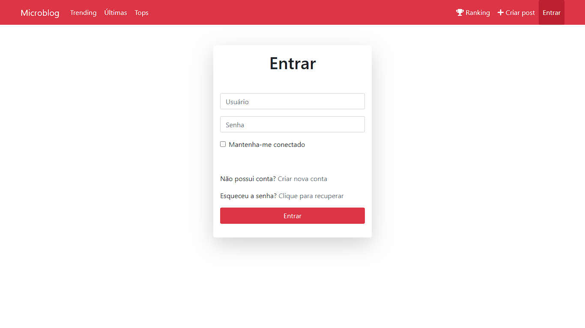
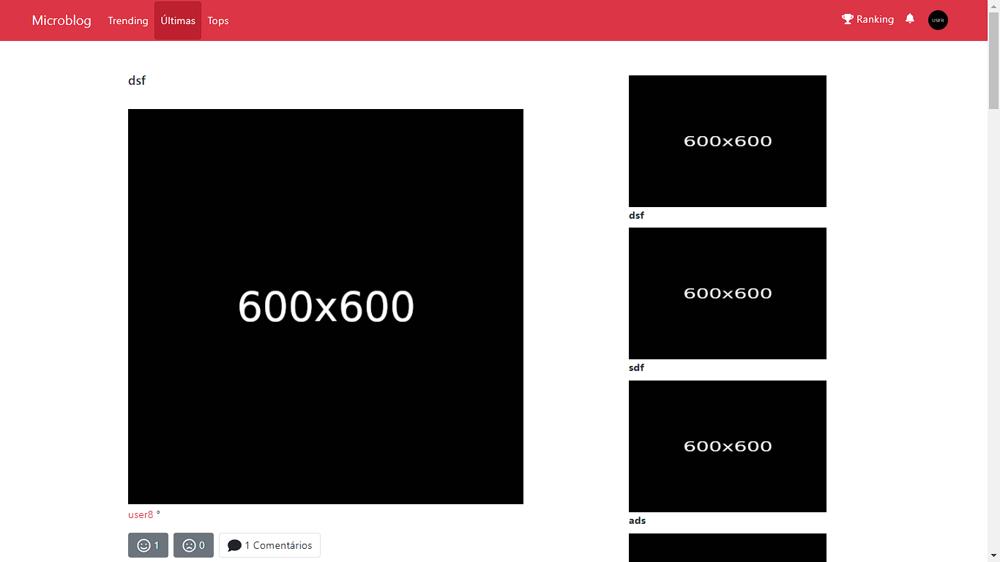
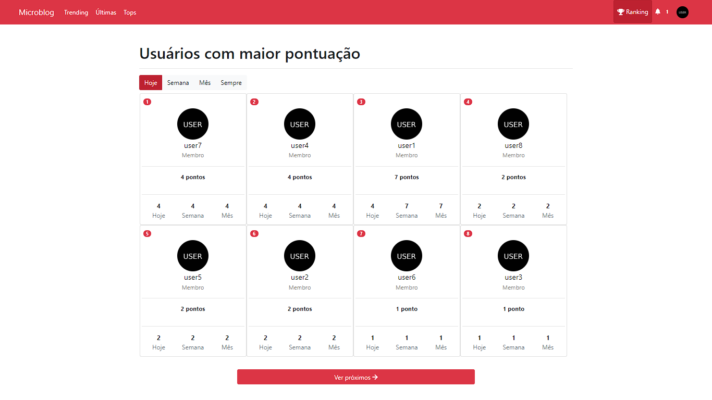
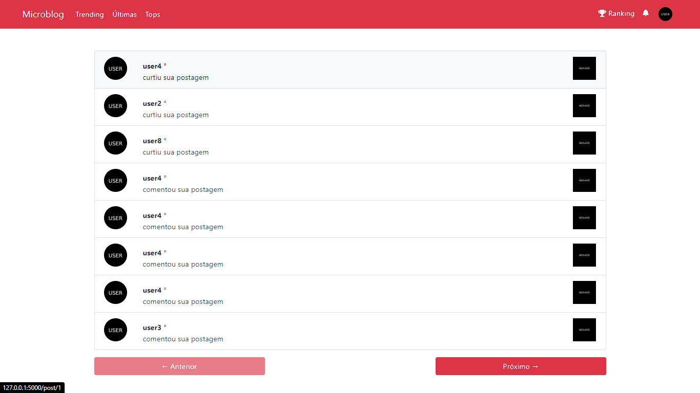

# Microblog

Projeto baseado na série de tutoriais feita por Miguel Grinberg "The Flask Mega-Tutorial"

## Funcionalidades

- Registrar/Login
- Criar, comentar e avaliar postagens;
- Ranking de usuários
- Notificações
- Recuperação de senha

## Screenshots

### Login

### Últimas postagens

### Ranking

### Notificações

## Tecnologias utilizadas

- Flask
- SQLite
- HTML
- CSS
- Bootstrap
- JQuery